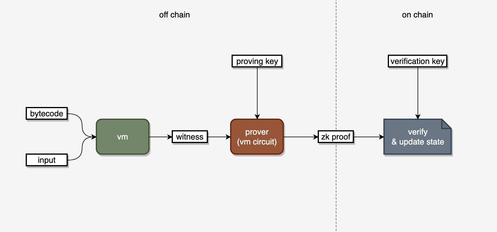

<p align="center">
    
    <a href="https://discord.gg/d6yMS2yycq"></a>
    <a href="https://twitter.com/zkmove"></a>
</p>

## zkMove

A zero-knowledge Move language runtime environment. Safe, Efficient, and Privacy-protected.

### Overview

**Zero-Knowledge Move Language Virtual Machine**. As a new generation of programming language for smart contract, Move ensures programming safety using its type checking, borrow checking and ownership mechanism. zkMove VM is fully compatible with Move and is the only zkVM with runtime type-safety!

zkMove circuit is built based on the Halo2 proof system. It supports Txn-level concurrent proving for low latency. It also supports client-side proving to naturally preserve user privacy.

**zkMove Trustless Data Service (TDS)**. A blockchain co-processing service built with zkMove, which enables smart contracts to access on-chain historical data in a trust-free manner, and allows arbitrary computations to be performed on the data.

### High-level architecture



### Documents

WIP.

### Source code

**zkMove Lite:** In the early designs, we had two types of circuits. VM circuit was used to handle conditional branches and loops, while Move circuits were compiled directly from Move bytecode, providing smaller circuit size. In the latest design, the advantages of the Move circuit have been absorbed by the VM circuit. However, as a starter material for learning zkMove, we have kept its code base.
https://github.com/young-rocks/zkmove-lite

**zkMove VM:** The core of zkMove VM is a general-purpose VM circuit. Like a generic VM circuit, it is Turing-complete. Unlike a normal VM circuit, the zkMove circuit can be application specific. This makes it has smaller size and shorter proving time. Its code is still in rapid iteration, and we will make the source code available as it becomes more stable.

### Example

We have a binary release for each development iteration to show the progress we have made. There is a [demo](./demo/README.md) with some examples in the package to demonstrate the latest functionality of zkMove virtual machine.

For example, the following command will first compile add.move into bytecode, execute the bytecode to generate an execution trace, then build the circuit and setup the proving/verifying key, and then generate a zkp for the execution with the proving key and finally verify the proof with the verifying key.

```bash
zkmove run -s examples/scripts/add.move
```

## License

zkMove is licensed as [Apache 2.0](./LICENSE).

