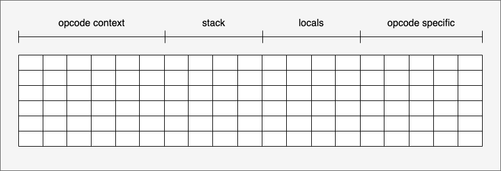

# Execution Circuit

The Execution Circuit is a sub-circuit of `VmCircuit`. Its purpose is to prove that Move bytecode is correctly executed by MoveVM.

## Overview

To prove correct execution of Move bytecode, zkMove must establish the following:

1. The correct bytecode is loaded.
2. Each bytecode instruction is executed correctly.
3. Every value read from memory equals the last value written to that address (memory consistency).

zkMove proves these properties by constructing an arithmetic circuit.

**Bytecode loading** is handled by storing bytecode in a Fixed Table. Because Move bytecode is compact by design, the lookup table remains small and does not significantly increase proof size.

The following sections describe the arithmetic circuit that proves correct bytecode execution. Memory consistency is covered in the next chapter.

## Circuit Structure

A PLONKish circuit is defined over a matrix of finite field elements. We use the conventional terms *row*, *column*, and *cell* to refer to elements in this matrix.

zkMove divides the circuit cells into two categories:

- **Shared cells** — cells used by all instructions (instruction context, stack/locals operations).
- **Instruction-specific cells** — cells used to express constraints unique to a particular instruction.

*Figure 1:*

<div>
  
</div>

### Shared Cells

**Instruction context** cells:

| `clk` | `frame_index` | `module_index` | `function_index` | `pc` | `sp` | `opcode` | `operand0` | `operand1` |
| --- | --- | --- | --- | --- | --- | --- | --- | --- |
| Global clock | Frame index of the current call | Module defining the current function | Current function index | Program counter | Stack pointer | Current opcode | Operand 0 | Operand 1 |

Each context cell is constrained according to execution semantics. For example, `pc` increments by 1 for sequential instructions and jumps to the target address for branch instructions. Other context fields follow similar constraint patterns.

**Stack and locals** cells:

| `stack_pop_index` | `stack_pop_sub_index` | `stack_pop_value` | `stack_pop_value_flag` | `stack_pop_version` | `stack_push_index` | `stack_push_sub_index` | `stack_push_value` | `stack_push_value_flag` | `stack_push_version` |
| --- | --- | --- | --- | --- | --- | --- | --- | --- | --- |

| `local_frame_index` | `local_index` | `local_sub_index` | `local_read_value` | `local_read_value_flag` | `local_read_version` | `local_write_value` | `local_write_value_flag` | `local_write_version` |
| --- | --- | --- | --- | --- | --- | --- | --- | --- |

Stack cells record an instruction's stack operations (values popped and pushed). Local cells serve a similar role for local variable reads and writes. Their detailed layout is described in later sections.

### Instruction-Specific Cells

zkMove maintains a shared **cell pool** to satisfy the cell allocation needs of each instruction's constraint logic. All instructions share this pool, maximizing cell utilization.

For example, if instruction A requires 5 cells and instruction B requires 10, the pool only needs to hold `max(5, 10) = 10` cells. The pool size is therefore determined by the most complex instruction.

### Multi-Row Instruction Layout

Shared cells and instruction-specific cells are allocated in the same row, one cell per column. However, most instructions involve multiple memory operations. For example, `add` requires two stack pops and one stack push, which requires two rows to record.

Additionally, Move instructions can operate on complex data structures (e.g., vectors) directly on the stack. To ensure memory correctness for such structures, zkMove uses a structured layout scheme that allows element-level constraints.

All rows belonging to a single instruction are treated as that instruction's **operation region**. Within this region:

- The instruction context (clk, pc, sp, opcode, operand) remains constant across rows.
- Stack and local operations follow the instruction's internal semantics.
- Each row includes a `step_counter` indicating how many rows remain for the current instruction.

**Example: `add` instruction**

| **clk** | **pc** | **sp** | **opcode** | **operand** | **step_counter** | **stack_pop_index** | **stack_pop_value** | **stack_pop_version** | **stack_push_index** | **stack_push_value** | **stack_push_version** | **local_read_value** | … | **local_write_version** |
| --- | --- | --- | --- | --- | --- | --- | --- | --- | --- | --- | --- | --- | --- | --- |
| 6 | 2 | 2 | Add | 1 | 2 | 2 | 3 | 5 | 0 | 0 | 0 | 0 | … | 0 |
| 6 | 2 | 2 | Add | 1 | 1 | 1 | 2 | 4 | 1 | 5 | 6 | 0 | … | 0 |

The context fields (`clk`, `pc`, `sp`, `opcode`, `operand`) are constant across both rows. The `stack_pop` and `stack_push` cells are assigned so that the second row satisfies the constraint:

```
stack_push_value(0) = stack_pop_value(-1) + stack_pop_value(0)
```

where `(0)` denotes the current row and `(-1)` denotes the previous row. Since `add` does not operate on locals, those cells are left empty.

Together, all cells form the circuit structure illustrated in Figure 1.
