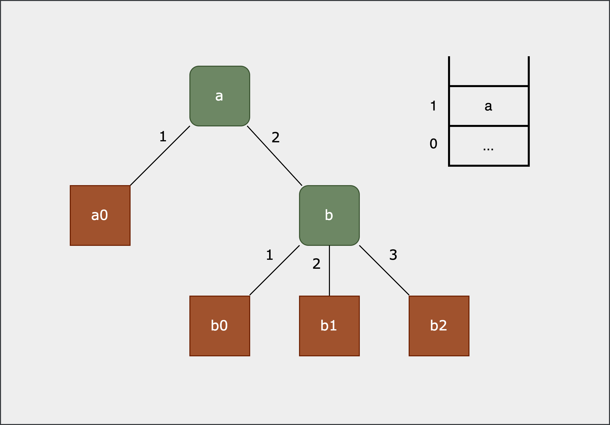

# Value Representation and Type Checking

## Types in Move

Move is unique among smart contract languages in providing runtime type safety. In MoveVM, every value on the stack or in local variables carries an explicit type. This stands in contrast to languages like Solidity, where all values are compiled down to untyped `U256` operands in the EVM.

## Circuit Representation of Types

MoveVM supports primitive types — `U8`, `U16`, `U32`, `U64`, `U128`, `U256`, `Bool`, `Address`, and `Reference` — as well as the complex types `Struct` and `Vector`.

```rust
/// Runtime value types in Move
pub enum Type {
    Bool,
    U8,
    U16,
    U32,
    U64,
    U128,
    U256,
    Address,
    Vector,
    Struct,
    Reference,
}
```
### Representing Simple Values

In the zkMove circuit, each primitive value is represented as a **Word**, which consists of two BN254 scalar field elements: `WordLo` (low 128 bits) and `WordHi` (high 128 bits), in little-endian order.

- **Integer types** (`U8`, `U16`, `U32`, `U64`, `U128`, `U256`): `WordLo` holds the lower 128 bits; `WordHi` holds the upper 128 bits.
- **Bool**: `WordLo` is `0` or `1`; `WordHi` is always `0`.

`Struct` and `Vector` are more complex: representing them requires not only their element values but also their structural layout.

### Representing Complex Values

Consider the following example:

```rust
struct A {
    a0: u8,
    a1: B,
}
struct B {
    b0: u8,
    b1: u64,
    b2: u64,
}

let b = B { b0: 1u8, b1: 2u64, b2: 3u64 };
let a = A { a0: 0u8, a1: b };
```

The layout of struct `a` can be represented as a tree (assuming `a` is stored at stack index `1`):

<div>
  
</div>

Flattening this tree produces the following list:

|       | `index` | `sub_index`          | `value` | `value_header` |
| ----- | ------- | -------------------- | ------- | -------------- |
| `a`   | 1       | 0,0,0,0,0,0,0,0      | 2,6     | true           |
| `a0`  | 1       | 1,0,0,0,0,0,0,0      | 0u8     | false          |
| `b`   | 1       | 2,0,0,0,0,0,0,0      | 3,4     | true           |
| `b0`  | 1       | 2,1,0,0,0,0,0,0      | 1u8     | false          |
| `b1`  | 1       | 2,2,0,0,0,0,0,0      | 2u64    | false          |
| `b2`  | 1       | 2,3,0,0,0,0,0,0      | 3u64    | false          |

In the circuit, a complex value is represented as a list of 4-tuples `(index, sub_index, value, value_header)`, where:

- **`index`** — the position of the value on the stack.
- **`value_header`** — a flag indicating whether this entry is a `ValueHeader`. A `ValueHeader` is a pair `(len, flen)`, where `len` is the number of direct members (struct fields or vector length) and `flen` is the total number of entries in the flattened list (always `≥ len` since it includes nested `ValueHeader`s).
- **`sub_index`** — the relative position of an element within a complex value. It is a fixed-size array `[u16; 8]`, supporting up to 8 dimensions with up to 2¹⁶ elements per dimension. `sub_index` is encoded as a `U128` value using a single BN254 scalar field element. Because sub-index ordering is not required to be monotonically increasing, little-endian byte order is used for better performance.

For **locals**, complex values are represented as 5-tuples `(index, sub_index, value, value_header, invalid)`, where `invalid` marks entries that have been moved out or invalidated.

### Representation of References

Given `index` and `sub_index`, references are straightforward. Any value — including members of complex values — can be referenced by the 2-tuple `(index, sub_index)`.

## Type Checking

### Static Type Checking

Move's static type checking is performed by the bytecode verifier at contract deployment time. zkMove does not build a dedicated circuit for the bytecode verifier; instead, its workflow requires the verification key to be published on-chain, ensuring that anyone can retrieve and verify the correctness of a smart contract.

### Dynamic Type Checking

Dynamic type checking is required only in the following situations:

- Passing arguments to an entry function
- Creating a value at runtime (`Pack`, `VecPack`)
- Modifying a value (`VecPushback`, `VecPopback`, `WriteRef`)
- Instantiating a generic type

In all other read/write operations, type correctness is guaranteed implicitly by MCC — there is no need for an explicit type check.

## Creating and Modifying Complex Values

The instructions that create or modify complex values are: `Pack`, `Unpack`, `VecPack`, `VecUnpack`, `VecPushback`, `VecPopback`, and `WriteRef`. We use `Pack` as an illustrative example.

The `Pack` bytecode includes an operand `StructDefinitionIndex`, which specifies the number of fields `n` and the type of each field. When creating a complex value, zkMove constrains the new value to be exactly composed of the `n` values popped from the stack.

Field types are not re-checked at this point: each field was already type-checked when it was originally created. Unless it was modified in transit, MCC is sufficient to guarantee its type remains correct.

The structural constraint is expressed via the relationship between the new value's `sub_index` and the popped members' `sub_index`. Since each level of `sub_index: [u16; 8]` occupies 16 bits, the constraint is:

```
stack_push_sub_index == stack_pop_sub_index << 16 + field_index
```

**Example:** Packing `a`, `b0`, and `b1` into `b`, where `a = {a0, a1}` and `b = {a, b0, b1}`:

| `stack_pop_index` | `stack_pop_sub_index` | `stack_pop_value` | `stack_pop_value_header` | `stack_push_index` | `stack_push_sub_index` | `stack_push_value` | `stack_push_value_header` | `field_idx` |
| --- | --- | --- | --- | --- | --- | --- | --- | --- |
|   |   |   |   | sp-2 | 0,0,0,0,0,0,0,0 | 3,6  | true  |   |
| sp   | 0,0,0,0,0,0,0,0 | b1   | false | sp-2 | 3,0,0,0,0,0,0,0 | b1   | false | 3 |
| sp-1 | 0,0,0,0,0,0,0,0 | b0   | false | sp-2 | 2,0,0,0,0,0,0,0 | b0   | false | 2 |
| sp-2 | 0,0,0,0,0,0,0,0 | 2,**3** | true  | sp-2 | 1,0,0,0,0,0,0,0 | 2,3  | true  | 1 |
| sp-2 | 1,0,0,0,0,0,0,0 | a0   | false | sp-2 | 1,1,0,0,0,0,0,0 | a0   | false | 1 |
| sp-2 | 2,0,0,0,0,0,0,0 | a1   | false | sp-2 | 1,2,0,0,0,0,0,0 | a1   | false | 1 |

## Dynamic Vectors

Move supports dynamically sized vectors via `VecPushback` and `VecPopback`. Consider the following example:

```rust
let v = vector[1, 2, 3, 4];
vector::push_back(&mut v, 5);
```

Before `push_back`, `v` is represented in the circuit as:

| `sub_index`         | `value` | `value_header` |
| ------------------- | ------- | -------------- |
| 0,0,0,0,0,0,0,0     | 4,5     | true           |
| 1,0,0,0,0,0,0,0     | 1       | false          |
| 2,0,0,0,0,0,0,0     | 2       | false          |
| 3,0,0,0,0,0,0,0     | 3       | false          |
| 4,0,0,0,0,0,0,0     | 4       | false          |

After `push_back(&mut v, 5)`:

| `sub_index`         | `value` | `value_header` |
| ------------------- | ------- | -------------- |
| 0,0,0,0,0,0,0,0     | 5,6     | true           |
| 1,0,0,0,0,0,0,0     | 1       | false          |
| 2,0,0,0,0,0,0,0     | 2       | false          |
| 3,0,0,0,0,0,0,0     | 3       | false          |
| 4,0,0,0,0,0,0,0     | 4       | false          |
| 5,0,0,0,0,0,0,0     | 5       | false          |

The circuit enforces two constraints for the new element:

```
new_field_sub_index = len + 1
(new_len, new_flen) = (len + 1, flen + 1)
```

If the new element is itself a complex value, the constraints are more involved. Refer to the spec or source code for the complete rules.

## Reading and Writing Complex Values

For all operations other than creation and modification, values are simply moved from one memory location to another. MCC is used to guarantee that no tampering occurs during transit.

**Correct read** is enforced by the following constraints:

- Exactly `flen` members must be read — no more, no less.
- Each entry must be a valid member (membership check).
- No `invalid` entries may be read.
- No duplicates (enforced by MCC).

**Correct write** is enforced by the following constraints:

- Each read member must be written back with the same `sub_index`, `value`, `header`, and `invalid` flag; only `version` is updated to the current clock.
- Writes to locals may overwrite existing entries; the overwritten entries must first be marked as `invalid`.

Complex value handling involves many additional details not fully enumerated here. Refer to the source code for the complete set of constraints.
