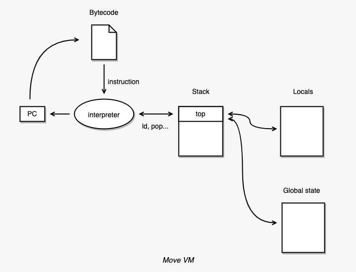
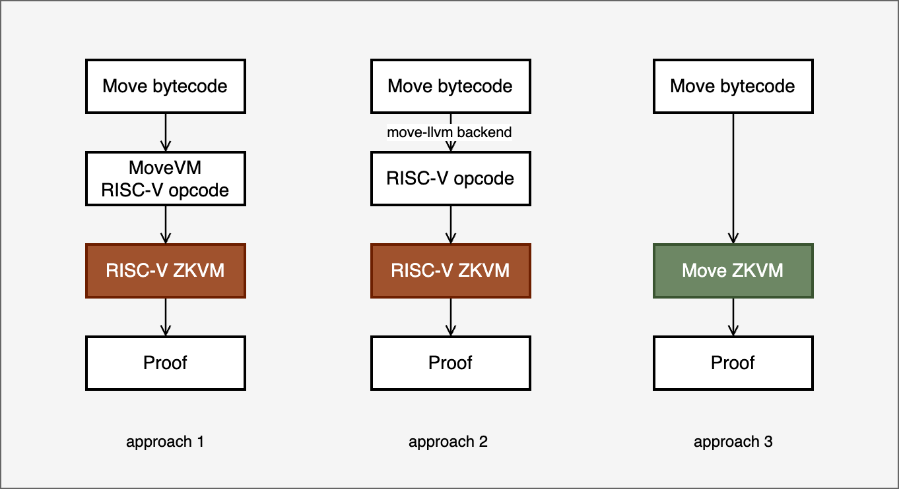

# ZKVM for Move

## The Move Programming Language

Move was originally developed by Meta (Facebook) for writing smart contracts on the Libra blockchain. With the rise of next-generation smart contract platforms — Sui and Aptos — the Move language has gained growing adoption among developers.

Move is built around two core design principles:

**Asset-oriented programming.** Digital assets are modeled as *resources*. Resources have strict ownership semantics: they cannot be copied, cannot be accidentally discarded or double-spent, and must be explicitly transferred or destroyed.

**Type safety and memory safety.** Move’s static type system and linear resource semantics eliminate entire classes of vulnerabilities at compile time — such as use-after-free errors, resource duplication, and accidental destruction — while its overall design (including strict ownership rules and module encapsulation) makes classic reentrancy attacks extremely difficult or impossible in most cases.

## The Move Virtual Machine

Move is designed to be cross-platform. Programs are compiled to bytecode and executed by the Move Virtual Machine (MoveVM).

MoveVM is a **stack-based bytecode virtual machine** composed of four main components:

- **Interpreter** — executes bytecode instructions sequentially
- **Operand stack** — holds intermediate computation values
- **Local variable storage** — stores function-local variables
- **Global state** — persistent on-chain storage

For simplicity, we refer to the stack, local variables, and global state collectively as *memory*.

  

The Move instruction set covers a broad range of operations:

- Stack push and pop
- Load and store of local variables
- Arithmetic and logical operations
- Type casting
- Control flow (branches, jumps)
- Function calls and returns
- Struct and vector operations
- Global state read/write
- Exception handling

Each instruction reads values from memory, applies the defined semantics, and writes the result back to memory.

## How to Build a ZKVM for Move

There are three main approaches to building a ZKVM for Move, each with distinct trade-offs.

### Approach 1: Run MoveVM on a RISC-V ZKVM

Since MoveVM is implemented in Rust, its source code can be compiled to RISC-V. A RISC-V ZKVM (such as RISC Zero or SP1) can then prove the correct execution of the resulting RISC-V binary.

**Advantage:** No need to build custom circuits for MoveVM; most of the toolchain already exists.

**Disadvantage:** The entire MoveVM is effectively "run inside" another virtual machine, resulting in a long execution path and poor performance.

### Approach 2: Compiling Move Bytecode to RISC-V via move-llvm

Move bytecode can be compiled to RISC-V instructions using the `move-llvm` backend, bypassing the MoveVM interpreter entirely.

**Advantage:** Better performance than Approach 1.

**Disadvantage:** MoveVM and the Move language are tightly coupled — the bytecode relies on runtime safety checks that cannot be replicated in RISC-V. Compiling bytecode to RISC-V breaks these runtime guarantees. Proposed workarounds (e.g., having a trusted party compile Move bytecode to LLVM IR) compromise decentralization.[^1]

### Approach 3: Build a Dedicated Circuit for MoveVM (zkMove's Approach)

zkMove takes the third approach: building a custom circuit that directly verifies the execution of Move bytecode against the MoveVM semantics.

**Advantage:** Achieves the best performance without sacrificing security. Because Move bytecode is executed directly on the ZKVM, we can exploit the program's code structure for further optimizations.

**Disadvantage:** Building a full circuit for MoveVM is a complex and time-intensive engineering effort.

  

[^1]: Brian Anderson. *Writing an LLVM backend for the Move language in Rust.* [https://brson.github.io/2023/03/12/move-on-llvm](https://brson.github.io/2023/03/12/move-on-llvm)
