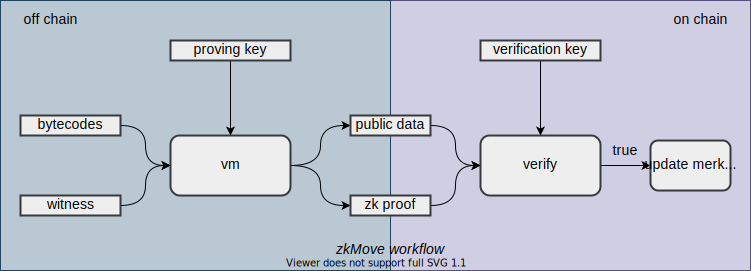

## zkMove：一个通用的区块链扩展引擎

| Author      | Version    | Date       |
| ----------- | ---------- | ---------- |
| Guangyu Zhu | Draft v0.1 | Jul.7.2021 |

#### 1.背景

随着 Defi 的繁荣以及非金融类智能合约的出现，以 Ethereum 为代表的公链的可扩展性正受到越来越大的挑战。虽然 Ethereum 可以采取分片等技术提升吞吐率，但是从长远来看，应用数量的增长会远远快于系统性能的提升，智能合约的逻辑也会越来越复杂，现有的区块链在设计上的问题将会逐渐显现。

产生拥堵的核心原因在于，任何一个交易想要上链，都需要大多数节点验证其合法性，而验证的方法就是执行该交易。如果智能合约的逻辑非常复杂，那么验证其合法性所耗费的计算资源累加起来会非常多，甚至会超过交易本身的价值，表现出来就是交易的拥堵和高昂的手续费。

为了从根本上提升区块链的可扩展性，我们提出了 zkMove —— 一个通用的区块链扩展引擎，它借鉴了 zkSync、StarkNet 以及 Mina 等项目的先进经验，把最安全的智能合约编程语言 $Move^1$ 和最成熟的零知识证明技术 $PLONK^2$ 完美结合，将计算从链上 “Move” 到链下，在保证安全的同时，大幅提升区块链的可扩展性。

#### 2.设计目标

**通用的区块链扩展引擎：**目前以太坊上大多数采用 zkp 的项目包括 Loopring、ZKSwap等，都是只支持单个应用场景，用户穿梭于链上链下实际上并不能省去多少交易费。$zkSync^3$、$StarkNet^4$ 的设计目标是提供通用的扩展方案，它们的多应用场景支持已经在计划当中。zkMove 也将加入这个行列，我们希望能将多年来在编程语言虚拟机领域的积累和零知识证明领结合在一起，打造一个通用的区块链扩展引擎，结合外围 circuit 标准库，使 DApp 开发者可以专注于业务逻辑，不再费心 circuit 如何开发。

**超越主链的安全性：**首先是继承主链的安全性。有了 zkMove 做基础，很容易在主链上构建各种 Layer2 解决方案，用户不必时刻监控网络，任何人或机构无法以任何方式盗取用户资金或者破坏用户状态，任何时刻用户都可以无条件提取资产。其次是超越主链安全性。我们将采用新一代面向数字资产的智能合约编程语言，结合形式化验证等工具，进一步增强 zkMove 的安全性。

**一个繁荣的创新平台：**就像Vitalic曾经在他的博客文章$^5$ 中描述的，从长远来看，主链最重要的目标是安全、稳定，不适合频繁的修改底层架构或者迭代新功能，功能性的创新更适合在Layer2上展开。zkMove 希望成为这样的试验台，向上连接各种DApp，向下连接各大公链，成为一个跨链的DApp扩展服务。

#### 3.核心架构

从分布式计算的角度，区块链是一个复制状态机（replicated state machine）：
$$
STF（S，txn) \to S'
$$
为了将计算从链上 “Move” 到链下，需要将账户状态$S$搬到链下，用默克尔树来维护，用户交易的签名校验、执行都在链下进行。只有当用户需要时才将其账户状态同步到链上，否则仅将状态的默克尔树根$R$上链，状态的正确性通过参与交易的账户的merkle_proof来保证。这一过程用复制状态机可以表示为：
$$
STF(R,\ accounts,\ merkle\_proof,\ txn)\ \to\ R'
$$
为了将计算从链上 “Move” 到链下，还需要将用户交易按提交顺序在链下执行，并生成零知识证明 $zkp$ 和压缩编码后的操作记录，然后将运行结果和 $zkp$ 提交到链上。链上的智能合约对$zkp$进行验证，验证通过则说明用户的交易确实被正确执行了，然后记录最新的默克尔树根$R'$。压缩后的操作记录作为智能合约的参数上链，作为用户交易记录。

如上图所示，zkMove 的核心是一个字节码虚拟机，bytecode 满足 Move 字节码规范。 Move 作为新一代面向数字资产的智能合约编程语言，它的安全性、形式化验证等特性基本满足 zkMove 的要求，我们将在 Move 的基础上进行创新。witness 是交易的输入，它通常包含参与交易的 $accounts，merkle\_proof$ 和执行交易前的状态树树根 $R$；public data 是交易的输出，它通常包含执行交易后新生成的状态树树根 $R'$ 和压缩后的用户操作记录。为了生成 size 更小的 zkp，zkMove 采用了 PLONK 零知识证明算法。PLONK 只需要一次可信初始设置，zkMove 将在发布智能合约时完成可信初始设置，生成 proving key 和 verification key 供 vm和 verifier 使用。

#### 4.实施计划

细节是魔鬼，一旦开始实现就会有许多细节问题需要解决，这个项目将会在实现的过程中逐步完善。我们计划分两步走：第一步实现核心架构所描述的功能，第二步选择有代表性的公链构建扩展服务。

#### 5.参考文献

[1] Sam Blackshear, Evan Cheng, David L. Dill, Victor Gao, Ben Maurer, Todd Nowacki, Alistair Pott, Shaz Qadeer, Rain, Dario Russi, Stephane Sezer, Tim Zakian, Runtian Zhou [*Move: A Language With Programmable Resources*](https://diem-developers-components.netlify.app/papers/diem-move-a-language-with-programmable-resources/2020-05-26.pdf)

[2] Ariel Gabizon, Zachary J. Williamson and Oana Ciobotaru [*PLONK: Permutations over Lagrange-bases for Oecumenical Noninteractive arguments of Knowledge*](https://eprint.iacr.org/2019/953)

[3] Alex Gluchowski [*Introduction to zkSync*](https://medium.com/matter-labs/introduction-to-zksync-16f3753ac96c)

[4] Eli Ben-Sasson, Iddo Bentov, Yinon Horesh and Michael Riabzev [*Scalable, transparent, and post-quantum secure computational integrity*](https://eprint.iacr.org/2018/046)

[5] Vitalik Buterin [*Layer 1 Should Be Innovative in the Short Term but Less in the Long Term*](https://vitalik.ca/general/2018/08/26/layer_1.html)

